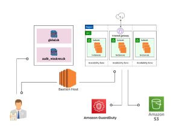

# Operating System Hardening


The project provides a comprehensive, automated solution to audit, patch, and secure Linux and Windows operating systems. Audits use Lynis and HardeningKitty, and patches are applied automatically. Target machines, located in a private subnet for better isolation, communicate via a secure Bastion Host. Audit results are centralized in an AWS S3 bucket, and Amazon GuardDuty actively monitors for threats. This project ensures increased compliance with security standards such as CIS and meets the security and efficiency needs of modern infrastructures.


## Table of Contents

 - [Features]()
 - [Installation]()
 
 - [License]()


## Features

- **Multi-Platform Security Audits**  
  Automated scanning for Linux (Lynis) and Windows (HardeningKitty) with CIS benchmark compliance checks

- **Automated Hardening**  
  Applies security patches and configuration fixes with optional rollback capability

- **Secure Architecture**  
  Bastion-host access pattern with private subnet isolation and encrypted communications

- **Centralized Compliance Reporting**  
  Stores all audit logs in encrypted AWS S3 with customizable dashboards

- **Threat Monitoring**  
  Real-time alerts via Amazon GuardDuty with SIEM integration

##  Requirements

### Infrastructure Requirements
- **Bastion Host**: Ubuntu 20.04+ with SSH access
- **Target Machines**:
  - Linux (Ubuntu/CentOS) for Lynis audits
  - Windows Server 2016+ for HardeningKitty
- **AWS Services**:
  - S3 bucket for report storage
  - IAM roles with proper S3 permissions

### Tool Dependencies
| Tool | Purpose | Installation |
|------|---------|--------------|
| `Lynis` | Linux auditing | `sudo apt install lynis` |
| `HardeningKitty` | Windows hardening | Auto-installed by script |
| `evil-winrm` | Windows remote exec | `gem install evil-winrm` |
| `AWS CLI` | S3 uploads | `sudo apt install awscli` |

### Credentials Needed
- Bastion SSH key (`os_hardening.pem`)
- Windows admin credentials
- AWS access keys with S3 write permissions

##  Usage

### 1. Linux Hardening (via Bastion)
```bash
./global.sh <BASTION_IP> scan      # Audit only
./global.sh <BASTION_IP> corrige   # Audit + auto-harden
```
### 2. Windows Hardening 
```bash
./audit_windows.sh audit   # Run security audit
./audit_windows.sh harden  # Apply hardening
```
## License


This project is licensed under the MIT License- See [LICENSE](https://choosealicense.com/licenses/mit/) for details.
## Authors

- [@SDX442](https://github.com/SDX442)
- [@YoussefElbadouri](https://github.com/YoussefElbadouri)

##
If it’s not patched, it’s pwned :)

